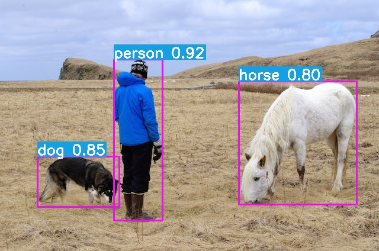

# yolov5-6.1-opencv-cpp

适配于当前2022-6-20 YoloV5最新版本Release6.1的OpenVINO加速的C++代码。

- 在YoloV5最新的更新版本中导出的IR模型版本为11，并且不能通过直接修改参数变成老版本IR10
- openVINO 推出了api2.0 版本，和原始版本有一定差异，其中api2.0支持IR11,而原始版本不支持

因此，部分较为老版本的推理代码均无法直接使用，本项目则基于openVINO api2.0 实现了YOLOv5的推理部署过程，支持cpu推理和集显GPU推理。

## 依赖项
- openVINO 2022.1 (老版本不支持api2.0)
- opencl (可选，集显加速)
- opencv

